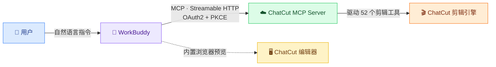

# 🎬 WorkBuddy × ChatCut MCP

<div align="center">

**用自然语言驱动 ChatCut 剪视频 —— 让 WorkBuddy 直接接管你的 AI 剪辑工作室**

[](./LICENSE)
[](./.github/workflows/secret-scan.yml)
[](https://github.com/chonpszhou/workbuddy-chatcut-mcp/commits/main)
[](https://github.com/chonpszhou/workbuddy-chatcut-mcp/stargazers)
[](https://github.com/chonpszhou/workbuddy-chatcut-mcp/network/members)
[](https://www.python.org)
[](https://oauth.net/2/)
[](https://modelcontextprotocol.io)

</div>

> 本项目提供接入所需的 OAuth 授权脚本、MCP 配置模板与操作手册。**不包含任何密钥** —— 令牌在你本地授权后生成，绝不进 git。

## 📑 目录

- [✨ 特性](#特性)
- [🧩 架构](#架构)
- [🚀 快速开始](#快速开始)
- [🖥️ 内置浏览器打开编辑器](#内置浏览器打开编辑器)
- [🔒 安全](#安全)
- [📁 文件说明](#文件说明)
- [🆚 为什么不直接用官方插件](#为什么不直接用官方插件)
- [🗺️ 路线图](#路线图)
- [🤝 贡献](#贡献)
- [📄 License](#license)

## ✨ 特性

| | |
|---|---|
| 🔌 | **标准 MCP 接入** —— Streamable HTTP，WorkBuddy 原生支持，零额外依赖 |
| 🔐 | **OAuth 2.0 + PKCE** —— 公共客户端形态，无 `client_secret`，无密钥泄露面 |
| 🪪 | **一键授权** —— 动态客户端注册 → 浏览器登录 → 自动写回配置 |
| 🔄 | **令牌续期** —— `access_token` 过期后 `refresh_token` 无感刷新 |
| 🖥️ | **内置浏览器剪辑** —— 配置完即在 WorkBuddy 预览面板打开 ChatCut 编辑器 |
| 🤖 | **52 个工具** —— 被 WorkBuddy 直接调用，自然语言即可驱动剪辑全流程 |

## 🧩 架构



ChatCut 把整间「剪辑室」以**托管 MCP Server** 开放在 `https://api.chatcut.io/api/external-mcp/mcp`。WorkBuddy 支持自定义 MCP，但不会自动弹 OAuth 登录框 —— 本项目用两个脚本完成握手：

1. `chatcut_auth.py`：动态注册 OAuth 公共客户端（PKCE/S256），打开浏览器让你授权，令牌写入 `~/.workbuddy/mcp.json`。
2. `chatcut_refresh.py`：`access_token` 约 1 小时过期，用它续期。

认证链路经实测可用（动态注册真实返回 `client_id`，`client_secret` 为 `null`）。

## 🚀 快速开始

```bash
# 1. 克隆本项目
git clone https://github.com/chonpszhou/workbuddy-chatcut-mcp.git
cd workbuddy-chatcut-mcp

# 2. 把 MCP 配置模板放进 WorkBuddy（仅 URL + 兼容头，无 token）
cp mcp.json.example ~/.workbuddy/mcp.json
#   若已有 mcp.json，请手动合并 chatcut 条目

# 3. 运行授权脚本，浏览器登录并授权
python3 chatcut_auth.py

# 4. 在 WorkBuddy 连接器面板找到 chatcut，点「信任 / 启用」
#   （工具数为 0 则重启 WorkBuddy）

# 5. 冒烟测试：用 list 类只读工具（如 list_projects），应加载约 52 个工具
```

令牌过期后续期：

```bash
python3 chatcut_refresh.py
```

## 🖥️ 内置浏览器打开编辑器

配置并信任 `chatcut` 后，可**不切外部浏览器**，直接在 WorkBuddy 内置预览面板打开 ChatCut 编辑器做手动精修。

**原理**：编辑器页（`app.chatcut.io/editor/<project_id>`）实测**无 `X-Frame-Options` / CSP `frame-ancestors` 限制**，可被内置浏览器直接嵌入。

### 方式一：对话式（推荐）

在 WorkBuddy 说「列出我 ChatCut 里的项目」，它调用 `list_projects` 返回每个项目的编辑器链接，**点链接即在面板打开**。

### 方式二：命令行拿链接

```bash
python3 open_projects.py
```

### 注意事项

- **首次**在面板打开需**登录一次 ChatCut 账号**（独立 webview，与外部浏览器不共享）；登录后 cookie 保留。
- 两类登录：MCP 的 OAuth token（已就绪）用于工具调用；ChatCut 网站 session 用于 web 编辑器精修。
- 真正「完全不切浏览器」的主路径是用自然语言让 WorkBuddy 调 ChatCut 工具（如「给某项目加字幕、掐头去尾」），连页面都不用开。

## 🔒 安全

- 本项目**不含任何 token / refresh_token / client_secret**。
- 真实凭证只在本地的 `~/.workbuddy/chatcut/credentials.json`（权限 600）与 `~/.workbuddy/mcp.json`（权限 600）。
- 🤖 **CI 自动兜底**：每次 push / PR 由 GitHub Actions 运行 [Gitleaks](https://github.com/gitleaks/gitleaks) 扫描，疑似密钥误提交即自动失败，挡在合并前（配置见 [`.github/workflows/secret-scan.yml`](./.github/workflows/secret-scan.yml) 与 [`.gitleaks.toml`](./.gitleaks.toml)）。
- 详见 [SECURITY.md](./SECURITY.md)。

## 📁 文件说明

| 文件 | 作用 |
|------|------|
| `chatcut_auth.py` | OAuth 登录：动态注册 + PKCE + 本地回调 + 写令牌 |
| `chatcut_refresh.py` | 用 `refresh_token` 续期 `access_token` |
| `mcp.json.example` | MCP 配置模板（仅 url + 兼容头，无 token） |
| `SKILL.md` | WorkBuddy Skill：剪辑能力说明与使用建议 |
| `open_projects.py` | 列出项目并输出可在内置浏览器打开的编辑器链接 |
| `SECURITY.md` | 安全与密钥管理规范 |
| `.gitignore` | 忽略凭证与本地文件 |

## 🆚 为什么不直接用官方插件

ChatCut 官方以 **ChatGPT 插件** 形式发布。本方案面向 **WorkBuddy** 用户，提供同等甚至更顺手的体验：

- 🤖 **Agent 原生驱动**：WorkBuddy 直接在对话框里调 52 个工具，无需切到插件界面。
- 🖥️ **内置浏览器精修**：配置完即可在 WorkBuddy 预览面板打开编辑器，不跳外部浏览器。
- 🔐 **零密钥提交**：仓库不含任何凭证，CI 自动扫密钥，安全可审计。
- 📦 **可复现**：脚本 + 模板 + 文档，三分钟从零接好。

## 🗺️ 路线图

- [ ] 多语言 README（已含中 / 英）
- [ ] `chatcut_refresh.py` 常驻守护进程（daemon）自动续期
- [ ] 示例：常见剪辑任务的 prompt 配方库
- [ ] 演示视频 / GIF

欢迎在 [Issues](https://github.com/chonpszhou/workbuddy-chatcut-mcp/issues) 提需求。

## 🤝 贡献

PR 永远欢迎！提交前请阅读 [CONTRIBUTING.md](./CONTRIBUTING.md)，并在 PR 中勾选安全自查清单（本仓库已配置 PR 模板）。

## 📄 License

[MIT](./LICENSE) © chonpszhou
