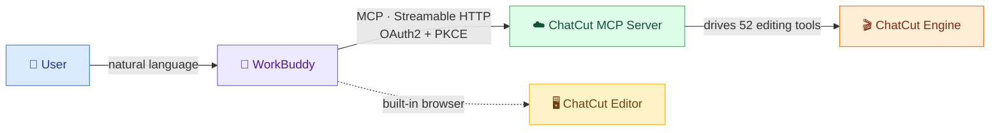

# 🎬 WorkBuddy × ChatCut MCP

<div align="center">

**Drive ChatCut with natural language — let WorkBuddy take over your AI editing studio**

[](./LICENSE)
[](./.github/workflows/secret-scan.yml)
[](https://github.com/chonpszhou/workbuddy-chatcut-mcp/commits/main)
[](https://github.com/chonpszhou/workbuddy-chatcut-mcp/stargazers)
[](https://github.com/chonpszhou/workbuddy-chatcut-mcp/network/members)
[](https://www.python.org)
[](https://oauth.net/2/)
[](https://modelcontextprotocol.io)

</div>

> This project provides the OAuth scripts, an MCP config template, and an operation manual needed for the integration. **It contains no secrets** — tokens are generated locally after authorization and never enter git.

## 📑 Table of Contents

- [✨ Features](#features)
- [🧩 Architecture](#architecture)
- [🚀 Quick Start](#quick-start)
- [🖥️ Open the Editor in WorkBuddy](#open-the-editor-in-workbuddy)
- [🔒 Security](#security)
- [📁 Files](#files)
- [🆚 Why not just use the official plugin](#why-not-just-use-the-official-plugin)
- [🗺️ Roadmap](#roadmap)
- [🤝 Contributing](#contributing)
- [📄 License](#license)

## ✨ Features

| | |
|---|---|
| 🔌 | **Standard MCP** — Streamable HTTP, natively supported by WorkBuddy, zero extra deps |
| 🔐 | **OAuth 2.0 + PKCE** — public client shape, no `client_secret`, no secret-leak surface |
| 🪪 | **One-click auth** — dynamic client registration → browser login → auto-write config |
| 🔄 | **Token refresh** — `refresh_token` silently renews `access_token` after expiry |
| 🖥️ | **In-app editing** — open the ChatCut editor right in WorkBuddy's preview panel |
| 🤖 | **52 tools** — callable by WorkBuddy; drive the whole editing flow in natural language |

## 🧩 Architecture



ChatCut exposes its whole editing studio as a **hosted MCP Server** at `https://api.chatcut.io/api/external-mcp/mcp`. WorkBuddy supports custom MCP but does **not** pop an OAuth dialog — this project uses two scripts to complete the handshake:

1. `chatcut_auth.py`: dynamically registers an OAuth public client (PKCE/S256), opens your browser to authorize, then writes the token into `~/.workbuddy/mcp.json`.
2. `chatcut_refresh.py`: `access_token` expires in ~1 hour; use this to renew it.

The auth flow is verified working (dynamic registration returns a real `client_id`, `client_secret` is `null`).

## 🚀 Quick Start

```bash
# 1. Clone
git clone https://github.com/chonpszhou/workbuddy-chatcut-mcp.git
cd workbuddy-chatcut-mcp

# 2. Drop the MCP config template into WorkBuddy (no token)
cp mcp.json.example ~/.workbuddy/mcp.json
#   If you already have an mcp.json, merge the chatcut entry manually.

# 3. Run the auth script, log in & authorize in the browser
python3 chatcut_auth.py

# 4. In WorkBuddy's Connectors panel, find chatcut and click "Trust / Enable"
#   (If tool count is 0, restart WorkBuddy)

# 5. Smoke test: a list-type tool (e.g. list_projects) should load ~52 tools
```

Renew after expiry:

```bash
python3 chatcut_refresh.py
```

## 🖥️ Open the Editor in WorkBuddy

After configuring and trusting `chatcut`, you can **stay inside WorkBuddy** and open the ChatCut editor in the built-in preview panel for manual fine-tuning.

**Why it works**: the editor page (`app.chatcut.io/editor/<project_id>`) was verified to have **no `X-Frame-Options` / CSP `frame-ancestors`** restriction, so it embeds directly.

### Option A: Conversational (recommended)

Say "List my ChatCut projects" in WorkBuddy — it calls `list_projects` and returns an editor link per project; **click to open in the panel**.

### Option B: From the CLI

```bash
python3 open_projects.py
```

### Notes

- **First time**, log in to ChatCut once in the panel (isolated webview, not shared with your external browser); the cookie persists.
- Two logins: the MCP OAuth token (ready) is for tool calls; the ChatCut session cookie is for manual editing.
- The truly "never leave the app" path is to tell WorkBuddy in natural language to call ChatCut tools — no page needed.

## 🔒 Security

- This project **contains no token / refresh_token / client_secret**.
- Real credentials live only in your local `~/.workbuddy/chatcut/credentials.json` (mode 600) and `~/.workbuddy/mcp.json` (mode 600).
- 🤖 **CI safety net**: on every push / PR, GitHub Actions runs [Gitleaks](https://github.com/gitleaks/gitleaks); a suspected leak fails the run and blocks the merge (config in [`.github/workflows/secret-scan.yml`](./.github/workflows/secret-scan.yml) and [`.gitleaks.toml`](./.gitleaks.toml)).
- See [SECURITY.md](./SECURITY.md) for details.

## 📁 Files

| File | Purpose |
|------|---------|
| `chatcut_auth.py` | OAuth login: dynamic registration + PKCE + local callback + write token |
| `chatcut_refresh.py` | Renew `access_token` using `refresh_token` |
| `mcp.json.example` | MCP config template (URL + compatibility header only, no token) |
| `SKILL.md` | WorkBuddy Skill: editing capability notes & usage tips |
| `open_projects.py` | List projects and print editor links openable in WorkBuddy |
| `SECURITY.md` | Security & secret-management spec |
| `.gitignore` | Ignore credentials and local files |

## 🆚 Why not just use the official plugin

ChatCut ships officially as a **ChatGPT plugin**. This project targets **WorkBuddy** users with an equal-or-better experience:

- 🤖 **Agent-native** — WorkBuddy calls the 52 tools right in the chat, no plugin UI to switch to.
- 🖥️ **In-app refinement** — open the editor in WorkBuddy's preview panel, no external browser hop.
- 🔐 **Zero-secret repo** — no credentials committed; CI scans for leaks; auditable.
- 📦 **Reproducible** — scripts + template + docs get you set up in three minutes.

## 🗺️ Roadmap

- [ ] Multi-language READMEs (zh + en done)
- [ ] `chatcut_refresh.py` as a long-running refresh daemon
- [ ] Prompt recipe library for common edits
- [ ] Demo video / GIF

Requests welcome in [Issues](https://github.com/chonpszhou/workbuddy-chatcut-mcp/issues).

## 🤝 Contributing

PRs are always welcome! Please read [CONTRIBUTING.md](./CONTRIBUTING.md) and check the security self-review box in the PR template (already configured).

## 📄 License

[MIT](./LICENSE) © chonpszhou
